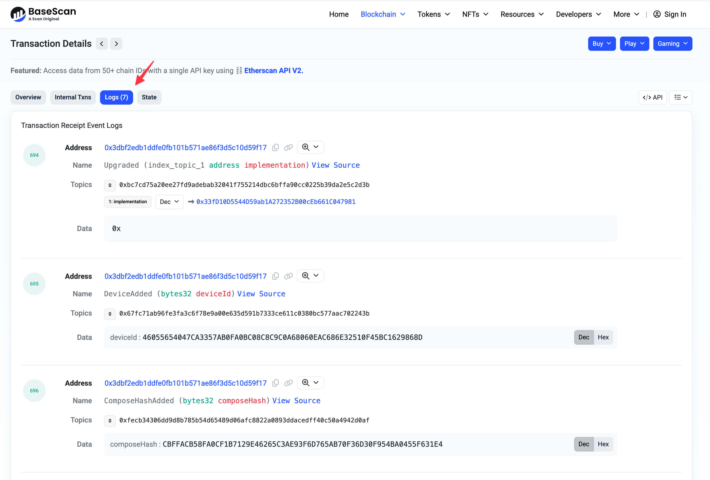
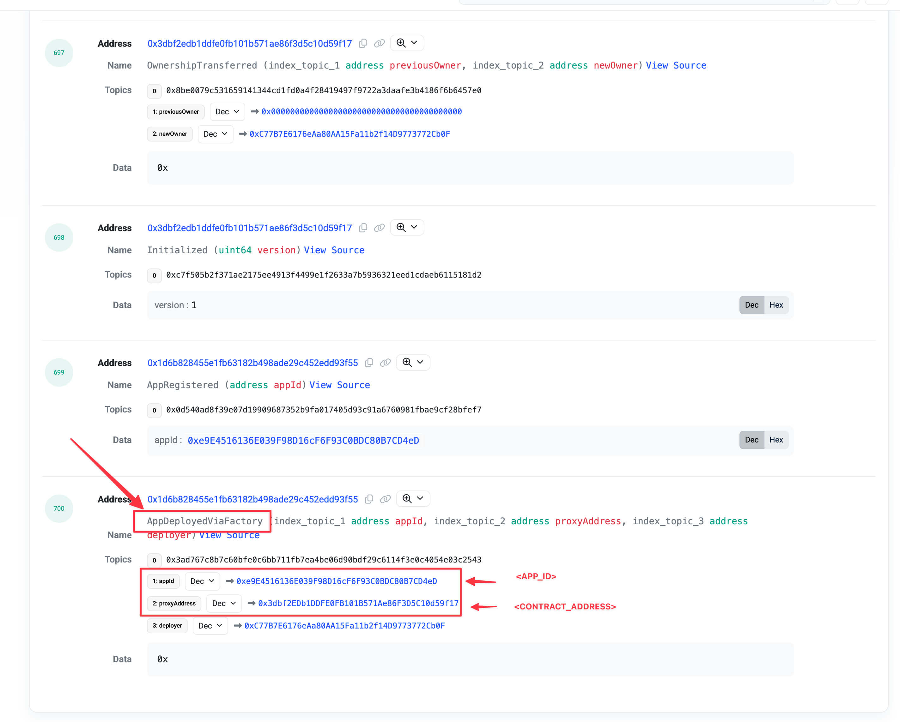

# deploy-dstack-v051

This is an example of launching a new CVM or updating the CVM on the Dstack 0.5.1 testnet node. This is a backward-compatible workaround, as no Dstack 0.5.1 public nodes are available for public use.

To use the scripts in the repo, you need the following tools:
- [bun](https://bun.sh/)
- [cast](https://getfoundry.sh/)

## Update CVM

To update a CVM, you need three steps:
1. Provision the update.
2. Register the compose hash on-chain.
3. Deploy the update.

Let's say the VM UUID is `<UUID>`. Your updated docker-compose.yml can be found in `<DOCKER_COMPOSE>`, run this command first:

```shell
bun run update/step1-provision.ts --env <DOTENV> <UUID> <DOCKER_COMPOSE>
```

Note: `<DOTENV>` is optional if no environment variables are updated:

```shell
bun run update/step1-provision.ts <UUID> <DOCKER_COMPOSE>
```

You'll see a similar message once provisioning succeeds:

```shell
The update has been provisioned, you need to execute the following command to deploy the update:
Step 1: register the compose_hash on chain:
cast send --rpc-url $RPC_URL --private-key $PRIVATE_KEY <CONTRACT_ADDRESS> 'addComposeHash(bytes32)' <COMPOSE_HASH>
Step 2: deploy the update:
bun run update/step2-deploy.ts <UUID> <COMPOSE_HASH> --env <DOTENV>
```

The message guides the next steps. First, export `RPC_URL` and `PRIVATE_KEY` as environment variables; if you don't have an `RPC_URL`, since the testnet relies on Base, you can use `https://mainnet.base.org`.

## Deploy new CVM

To launch a new CVM, follow these three steps:
1. Provision the CVM
2. Register the DstackApp on the DstackKms contract on-chain
3. Deploy the CVM

Let's say `<DOCKER_COMPOSE>` is the path to the `docker-compose.yml` file, run this command first:

```shell
bun run deploy/step1-provision.ts <DOCKER_COMPOSE>
```

You will find a similar message once it succeeds:

```shell
Provision succeed!
fmspec:  undefined
device_id:  46055654047ca3357ab0fa0bc08c8c9c0a68060eac686e32510f45bc1629868d
os_image_hash:  2e66f1f5c94cd911f31bb0b227add7c004a5559237ace47deabe670676c4b88c
compose_hash:  cbffacb58fa0cf1b7129e46265c3ae93f6d765ab70f36d30f954ba0455f631e4

 --------------------------------
Next Step: register your app on KMS.
Please replace PRIVATE_KEY with your private key and RPC_URL with the testnet RPC URL
cast send --rpc-url <RPC_URL> --private-key <PRIVATE_KEY> \
  0x1D6b828455E1fb63182B498AdE29c452Edd93F55 \
  'deployAndRegisterApp(address,bool,bool,bytes32,bytes32)' \
  $(cast wallet address <PRIVATE_KEY>) \
  false \
  false \
  46055654047ca3357ab0fa0bc08c8c9c0a68060eac686e32510f45bc1629868d \
  cbffacb58fa0cf1b7129e46265c3ae93f6d765ab70f36d30f954ba0455f631e4
```

This message will guide you on how to use `cast` to interact with the network. You will see the receipt on the screen. If the transaction is accepted, the `logs` in the receipt will not be empty. Next, you need to find the `app_id` in the transaction. Compose and paste the `blockHash` into [basescan](https://basescan.org), then locate the `appId` and `proxyAddress` in the logs:





Once you've found the `appId`, execute the third command to deploy it:

```shell
bun run deploy/step2-deploy.ts --app-id <APP_ID> --compose-hash <COMPOSE_HASH> --contract-address <CONTRACT_ADDRESS> --env <DOTENV>
```

Explain for each parameter:
- `<APP_ID>`: you can find it in the transaction logs.
- `<COMPOSE_HASH>`: you can find it in step 1.
- `<CONTRACT_ADDRESS>`: you can find it in the transaction logs.
- `<DOTENV>`: optional.